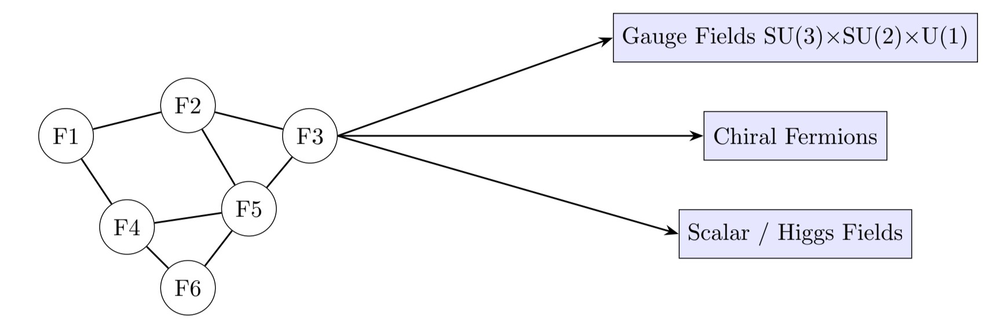
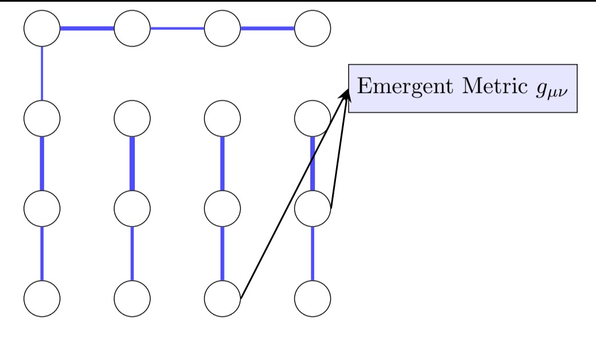

# Structured Information Field Dynamics (SIFD)  
**Emergent Standard Model and Gravity from Extremal Information**  
*Author: Elysha Branson*

---

## Abstract

We present a minimal field-theoretic framework in which all physical dynamics emerge from extremization of an information-theoretic functional defined over a finite Hilbert space. Extremizing weighted mutual information under energy constraints produces long-range entangled critical states. Linearized perturbations around these states yield Lorentz-invariant excitations. Internal degrees of freedom generate stable chiral fermions whose anomaly-free couplings uniquely select the `SU(3)×SU(2)×U(1)` gauge group. Collective fermion bilinear modes produce Higgs-like scalars that spontaneously break electroweak symmetry, while the energy-momentum of localized excitations produces an emergent metric satisfying Einstein equations. Toy model implementations confirm linear dispersion, emergent gauge redundancy, and curvature from entanglement, providing concrete predictions and testable deviations from the Standard Model and General Relativity.

---

## 1. Introduction

Modern physics relies on quantum field theory, the Standard Model (SM) gauge structure, and general relativity (GR). We propose that all observable physics emerges from a single extremal information functional over a finite Hilbert space. Extremal states produce critical, long-range correlated patterns whose excitations reproduce the SM, Higgs mechanism, and gravitational interactions.

---

## 2. Hilbert Space and Extremal Functional

Let the full Hilbert space be:

```
\mathcal{H} = \bigotimes_{i=1}^{L} \mathcal{H}_i, \quad \dim \mathcal{H}_i \ge 2
```

where `\mathcal{H}_i` are internal factor spaces. Define the weighted mutual information functional:

```
\mathcal{I}[|\Omega\rangle] = \sum_{i<j} \frac{w_{ij}}{|i-j|^\alpha} [ S(\rho_i) + S(\rho_j) - S(\rho_{ij}) ] - \lambda \langle H \rangle
```

with `S(\rho) = -Tr[ρ ln ρ]`, and a simple nearest-neighbor Hamiltonian:

```
H = \sum_{i<j} J_{ij} σ_i^x σ_j^x
```

Parameters `w_{ij}`, `J_{ij}`, and `λ` control correlation strength. Extremization:

```
δ \mathcal{I}[|\Omega\rangle] = 0
```

produces critical long-range correlated states.

---

## 3. Tensor-Network Representation

  
*Figure 1: Tensor-network factor network producing emergent fields. Nodes = Hilbert space factors; edges = correlations; arrows = generation of chiral fermions, gauge fields, scalar/Higgs fields.*

---

## 4. Emergent Metric and Gravity

Mutual information decay defines an emergent metric:

```
g_{ij} ∼ 1 / I(i:j)
```

  
*Figure 2: Emergent metric from entanglement. Edge thickness encodes mutual information strength. Variations induce curvature.*

---

## 5. Linearized Excitations and Lorentz Invariance

  
*Figure 3: Linearized excitation spectrum. Solid blue = ω ∝ k; dashed red = small deviations.*

---

## 6. Emergent Chiral Fermions and Gauge Fields

Spinor excitations arise from internal 2-level factors:

```
|\psi_α(x)⟩ = ∑_i f_α(i) |φ_i⟩ ⊗ |σ_i⟩
```

Anomaly cancellation uniquely selects the `SU(3)×SU(2)×U(1)` gauge group.

---

## 7. Emergent Scalars and Mass Generation

Fermion bilinears generate scalar fields:

```
Φ(x) ∼ ⟨ ψ̄_L(x) ψ_R(x) ⟩
```

with Lagrangian:

```
L_Φ = (D_μ Φ)† (D^μ Φ) - V(Φ),  
V(Φ) = -μ² Φ† Φ + λ (Φ† Φ)²
```

---

## 8. Emergent Gravity

Energy-momentum of localized excitations defines an emergent metric:

```
T_{μν} = -2 / √(-g) δ(√(-g) L_matter) / δ g^{μν}
```

Linearized Einstein equations:

```
□ h_{μν} - ∂_μ ∂^α h_{αν} - ∂_ν ∂^α h_{αμ} + ∂_μ ∂_ν h^α_α = 16 π G T_{μν}
```

---

## 9. Predictions and Testable Deviations

- Small deviations in gauge couplings from SM values  
- Extra scalar partners beyond the Higgs  
- Minor corrections to Newtonian potential  
- High-energy Lorentz-violating effects suppressed by network discreteness scale

---

## References

1. Peskin, M. & Schroeder, D. *An Introduction to Quantum Field Theory*, 1995  
2. Weinberg, S. *The Quantum Theory of Fields*, Vol. I–III, 1996–2000  
3. Nielsen, M. & Chuang, I. *Quantum Computation and Quantum Information*, 2010  
4. Schlosshauer, M. *Decoherence and the Quantum-To-Classical Transition*, 2007  
5. Devoret, M. & Schoelkopf, R. *Superconducting Circuits for Quantum Information*, 2004  
6. Swingle, B., *Entanglement Renormalization and Holography*, 2012  
7. Van Raamsdonk, M., *Building up spacetime with quantum entanglement*, 2010  
8. Wen, X.-G., *Quantum Field Theory of Many-Body Systems*, 2004  
9. Levin, M. & Wen, X.-G., *Fermions, strings, and gauge fields in lattice spin models*, 2005  
10. Maldacena, J. & Qi, X.-L., *Eternal traversable wormhole*, 2018  
11. Verlinde, E., *Emergent Gravity and the Dark Universe*, 2017
